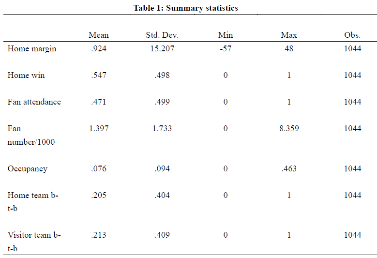

# Abstract

For this project, we utilized a fixed effect regression model and a
random forest model to investigate the impact of fan support on home
court advantage in the NBA during the 2020-2021 regular season. Our
research provides compelling evidence that fan support has a
statistically significant influence on home court advantage.
Specifically, games with fan attendance resulted in home teams scoring
an additional 3.113 points and winning 11.6% more frequently compared to
games without fans. Thus, increasing fan numbers and occupancy can have
a substantial effect on home court advantage. Furthermore, we
demonstrate that our random forest models can predict win rates with
around 70% accuracy. If we employ specific team data, the model’s
performance could potentially improve.

# Introduction

In the United States, the sports industry has always been a popular
topic of continuous interest among people, with team sports such as NBA
and MLB being the most popular. Almost every restaurant you go to, you
can see the television broadcasting sports games, and hear the
announcers and commentators analyzing the game intensely. In the end,
one team wins and gets everyone’s applause. It makes us wonder; what
factors actually affect the outcome of the game? Needless to say, the
players’ skills can lead the team to victory. However, in these games
with a large audience, fans watching the game play an important role in
an intangible way. You often hear players say in post-game interviews
that it is the support of the fans at the venue that allows us to
perform so well. This seemingly polite remark begs the question of
whether it actually has an impact on the game. In many professional
sports leagues, home venues play a significant role in influencing the
win rate of matches. Typically, the home team receives several
advantages, such as fan support, venue familiarity, and an unneutral
referee. These factors, combined, propel the home team to victory. After
accounting for two unquantifiable variables, namely, the familiarity of
the home court and the potential bias of the referees, fan support seems
to be the most likely data that we can obtain for analysis. Therefore,
we plan to investigate how fan support affects the outcome of games.
However, in most games, popular teams are often in high demand, with
every seat filled regardless of the time of day, while unpopular teams
may not see a significant increase in attendance even during the
playoffs. Such little variation in the data is not favorable for
prediction. Nevertheless, Covid-19 created a unique opportunity to
address this problem. Several professional sports leagues were affected
due to anti-epidemic policies in several countries, which led to
restrictions on fan attendance in many courts to avoid swarm infections.
In this project, we use data from the 2020-21 National Basketball
Association (NBA) matches to identify the impact of fan attendance on
the home-court advantage and predict the outcome of game by fan
attendance. Most matches this season limited fan attendance, with only a
few allowing thousands of fans. The crowd size was extremely low
compared to past years due to health regulations. From the results, we
find strong evidence that fan support significantly influences
home-court advantage. Compared to games without fans, the home team
scores more than 3.564 points, and the home team’s win rate increases by
12.1% with fan attendance. Moreover, using random forest model to
predict the win rate, we have about 70% prediction accuracy. In
conclusion, the fan support could effectively be used to predict the
home-court advantage.

# Data

This paper analyzes data from the 2020-2021 NBA regular season,
including limitations on fan attendance at each court and NBA in-game
data. The data was procured from
[https://www.basketball-reference.com](https://www.basketball-reference.com/).
Our database includes detailed information for each game, such as date,
home team, and away team. We also consider other influential factors,
such as whether the game is on the weekend or is back-to-back. Moreover,
the most vital variables, fan attendance, court capacity, home points,
and away points, are also in our database. We removed the data for games
where the Toronto Raptors were the home team because they played on a
court in the United States instead of their court. This may have caused
problems with fan attendance, as we cannot assume that most fans came
from Canada. This project only focuses on data from the regular season
instead of playoff games because most playoff games had no limitations
on fan attendance, making the courts full. If we also considered data
from playoff games, the independent variable, fan attendance, would have
little variation without the health policy restrictions. Thus, to ensure
that our model could predict the results well, it is essential to
exclude playoff games.

# Methodology

## Fixed Effect Model

The primary objective of this project is to predict the home-court
advantage by fan support. To accomplish this, we must first define the
fan support. We utilize the attendance of fans, which is provided by the
basketball-reference website, as it is a suitable indicator of fan
support, assuming that most fans support the home team. In our
estimation, we utilize three variables to represent fan attendance,
including the number of fans divided by one thousand, the number of fans
divided by the court capacity, and the total number of fans in
attendance. Additionally, it is crucial to clearly define the dependent
variable of home court advantage. For this purpose, we use a
straightforward measure of the point differential between the home team
and the visiting team, which we refer to as “home margin” in this paper.
We also include another variable, “home win,” to assess the impact of
fan support on the home team’s win rate. To precisely estimate the
effect of fan support, we conduct two separate regressions using the
independent variables of home margin and home win.  

We simply estimate two fixed effects regression models of the following
form:

〖home court advantage〗*(i,k,t) =β\_0+ β\_1 〖attendence〗*(i,k,t)+β\_2
〖hb〗*(i,t)+β\_3 〖vb〗*(k,t)+X+〖e 〗\_(i,k,t) (1)

where 〖home court advantage〗*(i,k,t) measures the home court advantage
in two variables, home margin and home win. 〖attendence〗*(i,k,t)
represent fan attendance in three variables mentioned above.
〖hb〗*(i,t) and 〖vb〗*(k,t) are whether home team and visitor team
facing back-to-back game, appending these two variables in estimation
because back-to-back game probably influenced the performance of
players. It fluctuates with time t, home team i and visitor team k.
Besides, X gives a matrix of covariates including home team fixed
effects, visitor team fixed effects and time fixed effects. In addition,
we use robust standard error and cluster in home team level, to allowing
team performance are correlated.

## Random Forest Model

This part we utilized the random forest model, considering the
heterogeneity of variable types. Moreover, conducting the random forest
would be able to find and consider each interaction and combination of
team characteristics in our data. In the model, the complexity parameter
was set at 0.002 and 300 trees was used. For cross-validation, the data
(nbafans) is split into training and testing sets with 20% of the data
reserved for testing. Variable pt\_diff refers to the dependent
variable. Variables v\_btb, h\_btb, weekend, startet, strong\_home,
note, finish, att\_rate, month and homeneutral account as the
independent variables. The complexity parameter for the decision tree
model is placed at 0.02; Minimum observations for the split are set at
300; Max depth is set at 4. For the random forest, the complexity
parameter is set at 0.002 and the number of trees is set at 300. For
cross-validation, the data is split into testing and training sets with
20% of the data reserved for testing.

Writing equation for the random forest model: pt\_diff / fg\_diff ~
v\_btb + h\_btb + weekend + startet + strong\_home + note + finish +
att\_rate + month

-   pt\_diff: score of the home team minus the score of the visitor team
-   fg\_diff: the difference between the home team’s and visitor team’s
    field goal percentage, 3-pointer percentage, and free throw
    percentage
-   v\_btb: equal 1 if the visitor team plays a back-to-back game
-   h\_btb: equal 1 if the home team plays a back-to-back game
-   weekend: equal 1 if the game is played on the weekend
-   startet: the time (ET) of the game started
-   strong\_home: equal 1 if the home team’s winning game count is
    higher than that of the visitor team
-   note: whether it’s a regular-season game or a playoff game
-   finish: whether it’s an over-time game
-   att\_rate: audience attendance rate
-   month: the month when the game is held

# Results

## Part I: Descriptive Analysis

To begin our analysis, we opt to examine our data in a straightforward
manner. As previously mentioned, the home-court advantage is a prevalent
phenomenon in many professional sports, including the NBA. We can
observe this trend from the summary statistics presented in Table 1.
Specifically, we note that the home team had a win rate of 54% during
the 2020-2021 regular season, and the average point differential between
the home team and the visiting team was 0.924. Due to government
policies, nearly half of the games were played without any fan
attendance, which provided us with a significant amount of variation in
fan numbers. Furthermore, we found that the average fan attendance
during the season was 1397, and the average occupancy rate was 7.6%.
These statistics provide us with a starting point for understanding the
relationship between fan support and home court advantage in the NBA.

<table class="table" style="margin-left: auto; margin-right: auto;">
<caption>
Summary Statistics
</caption>
<thead>
<tr>
<th style="text-align:left;">
Variable
</th>
<th style="text-align:left;">
N
</th>
<th style="text-align:left;">
Mean
</th>
<th style="text-align:left;">
Std. Dev.
</th>
<th style="text-align:left;">
Min
</th>
<th style="text-align:left;">
Pctl. 25
</th>
<th style="text-align:left;">
Pctl. 75
</th>
<th style="text-align:left;">
Max
</th>
</tr>
</thead>
<tbody>
<tr>
<td style="text-align:left;">
homemargin
</td>
<td style="text-align:left;">
1044
</td>
<td style="text-align:left;">
0.92
</td>
<td style="text-align:left;">
15
</td>
<td style="text-align:left;">
-57
</td>
<td style="text-align:left;">
-9
</td>
<td style="text-align:left;">
11
</td>
<td style="text-align:left;">
48
</td>
</tr>
<tr>
<td style="text-align:left;">
homewin
</td>
<td style="text-align:left;">
1044
</td>
<td style="text-align:left;">
0.55
</td>
<td style="text-align:left;">
0.5
</td>
<td style="text-align:left;">
0
</td>
<td style="text-align:left;">
0
</td>
<td style="text-align:left;">
1
</td>
<td style="text-align:left;">
1
</td>
</tr>
<tr>
<td style="text-align:left;">
fandum
</td>
<td style="text-align:left;">
1044
</td>
<td style="text-align:left;">
0.47
</td>
<td style="text-align:left;">
0.5
</td>
<td style="text-align:left;">
0
</td>
<td style="text-align:left;">
0
</td>
<td style="text-align:left;">
1
</td>
<td style="text-align:left;">
1
</td>
</tr>
<tr>
<td style="text-align:left;">
att1000
</td>
<td style="text-align:left;">
1044
</td>
<td style="text-align:left;">
1.4
</td>
<td style="text-align:left;">
1.7
</td>
<td style="text-align:left;">
0
</td>
<td style="text-align:left;">
0
</td>
<td style="text-align:left;">
3.1
</td>
<td style="text-align:left;">
8.4
</td>
</tr>
<tr>
<td style="text-align:left;">
occ
</td>
<td style="text-align:left;">
1044
</td>
<td style="text-align:left;">
0.076
</td>
<td style="text-align:left;">
0.094
</td>
<td style="text-align:left;">
0
</td>
<td style="text-align:left;">
0
</td>
<td style="text-align:left;">
0.17
</td>
<td style="text-align:left;">
0.46
</td>
</tr>
<tr>
<td style="text-align:left;">
h\_btb
</td>
<td style="text-align:left;">
1044
</td>
<td style="text-align:left;">
0.2
</td>
<td style="text-align:left;">
0.4
</td>
<td style="text-align:left;">
0
</td>
<td style="text-align:left;">
0
</td>
<td style="text-align:left;">
0
</td>
<td style="text-align:left;">
1
</td>
</tr>
<tr>
<td style="text-align:left;">
v\_btb
</td>
<td style="text-align:left;">
1044
</td>
<td style="text-align:left;">
0.21
</td>
<td style="text-align:left;">
0.41
</td>
<td style="text-align:left;">
0
</td>
<td style="text-align:left;">
0
</td>
<td style="text-align:left;">
0
</td>
<td style="text-align:left;">
1
</td>
</tr>
</tbody>
</table>

## Part I: Fixed Effect Model

In this section, we will present the results of the fixed effects
regression models (1) discussed in the previous section. Table 2
displays the effect of fan support on the point differential. On
average, fan attendance leads to the home team winning by 3.113 more
points than the visiting team, and this effect is statistically
significant at the 95% confidence level. Specifically, an increase of
one thousand fans results in the home team winning by an additional
0.834 points. Additionally, compared to games played in vacant arenas,
games played in full arenas result in the home team winning by an
additional 15.586 points.

Table 3 presents the results of the second model where the dependent
variable is whether the home team wins, using the same independent
variables. Based on the results in Table 3, we observe that fan
attendance increases the home team’s win rate by 11.6% compared to games
played in vacant arenas, and this effect is statistically significant at
the 95% confidence level. On average, a one-thousand increase in fan
attendance results in a 2.9% increase in the home team’s win rate.
Furthermore, games played in full arenas result in a 55.9% increase in
the home team’s win rate compared to games played in vacant arenas. Both
of these effects are statistically significant at the 90% confidence
level.

The results of both fixed effects regression models provide strong
evidence that fan support has a significant impact on home court
advantage in professional basketball, even after controlling for time,
home team, and visitor team fixed effects. The findings demonstrate that
fan attendance increases the home team’s point difference and win rate,
which confirms the influence of fan support on home court advantage with
statistical significance.

## Part III: Random Forest Model

### A. Points Difference

<table>
<thead>
<tr class="header">
<th style="text-align: left;">Model</th>
<th style="text-align: right;">RMSE</th>
</tr>
</thead>
<tbody>
<tr class="odd">
<td style="text-align: left;">Tree</td>
<td style="text-align: right;">16.04336</td>
</tr>
<tr class="even">
<td style="text-align: left;">Forest</td>
<td style="text-align: right;">16.40788</td>
</tr>
</tbody>
</table>

According to the table above, the out-of-sample root means squared error
(RMSE) is observed. Although we suspect that the back-to-back game and
games on the weekend bias the model in favor of points, the variable
importance plot above shows that the back-to-back game and games on the
weekend are the least important variables to our model’s accuracy.

### B. Field Goal Percentage (FG%)

<table>
<thead>
<tr class="header">
<th style="text-align: left;">Model</th>
<th style="text-align: right;">RMSE</th>
</tr>
</thead>
<tbody>
<tr class="odd">
<td style="text-align: left;">Tree</td>
<td style="text-align: right;">0.2523205</td>
</tr>
<tr class="even">
<td style="text-align: left;">Forest</td>
<td style="text-align: right;">0.2567102</td>
</tr>
</tbody>
</table>

From the table above, the RMSE is observed. Similar to the variable
importance plot of points difference, playing back-to-back games, games
on the weekend and overtime games are the least important variables to
our model’s accuracy.

### Subsample of Teams in Texas – Mavericks, Spurs & Rockets (see graphs in appendix)

#### A. Points Difference

<table>
<thead>
<tr class="header">
<th style="text-align: left;">Model</th>
<th style="text-align: right;">RMSE</th>
</tr>
</thead>
<tbody>
<tr class="odd">
<td style="text-align: left;">Mavericks Forest</td>
<td style="text-align: right;">14.97487</td>
</tr>
<tr class="even">
<td style="text-align: left;">Spurs Forest</td>
<td style="text-align: right;">18.26306</td>
</tr>
<tr class="odd">
<td style="text-align: left;">Rockets Forest</td>
<td style="text-align: right;">14.23201</td>
</tr>
</tbody>
</table>

The model conducted previously controls for homeneutral (home team),
while more robust findings are observed when splitting off the data. The
result of separating the teams shows that different teams seem to be
affected by different variables. Moreover, the negative values of
variables for the Spurs and Rockets are observed because both teams were
“tanking” in the 2021-2022 season. Furthermore, playing over-time games
plays an important role when determining the effect of home-court
advantage on Maverick’s box score. Focusing on each team separately
allows the model to test the more accurate importance of each predictor.
The RMSE results show that the effect of home-court advantage on points
difference (points advantage) can be predicted for Mavericks and Rockets
much more precisely than for the Spurs.

#### B. FG% Difference

Similar to the results of the team points difference importance plots,
more robust findings for the Mavericks are observed when splitting off
the data. Also, audience attendance rate plays an important role when
determining the effect of home-court advantage on the Maverick’s field
goal percentage, 3-pointer percentage and free throw percentage.

### Model Building - Winning Outcome

In addition to predicting score differentials and free throw
differentials, we also employed a random forest model to predict game
outcomes. With variables such as fan attendance rates and home/away team
data, our model has a 70% chance of accurately predicting the winner of
an NBA game.

# Conclusion

In this project, we employed a fixed effect regression model and random
forest model to examine the impact of fan support on home court
advantage and predict the home-court advantage by the fan support in the
NBA during the 2020-2021 regular season. Our findings reveal compelling
evidence that fan support has a statistically significant influence on
home court advantage. Specifically, compared to games without fans,
games with fan attendance resulted in home teams scoring 3.113 more
points and winning 11.6% more often. Thus, increasing fan numbers and
occupancy can significantly affect home court advantage. Moreover, we
also show that our random forest models have about 70% prediction
accuracy of predicting win rates. Additionally, if we use specific team
data to predict their outcome, it would probably have better
performance.

# Appendix

